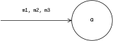
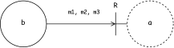

# Definition vs. Use

- [Introduction](#introduction)
- [Roles](#roles)
- [Aggregates](#aggregates)
- [Concepts](#concepts)
- [Final Remarks](#final-remarks)
- [References](#references)

## Introduction

In this note, we discuss ways of capturing the context of use (i.e., the larger environment in which the computation happens) that do not hinder our ability to respond to change. The key intuition is that the relationship with the environment should be defined separately from the other constituents of the system. We see how to apply this idea when dealing with objects, information and algorithms.

To stress out the conversational nature of OOP, we will refer to objects using the he/his pronouns.

## Roles

Let's assume the existence of a given object `a`. Let's also assume that such an object `a` understands a certain number of messages — say `m1`, `m2` and `m3`.

<br/>
<div align="center">
  
  <p><sub>Figure 1. <code>a</code> understands <code>m1</code>, <code>m2</code> and <code>m3</code></sub></p>
</div>
<br/>

In the spirit of OOP, other objects — like `b` in Figure 2, can ask `a` to provide some service by sending the appropriate combination of `m1`, `m2` and `m3` messages.

<br/>
<div align="center">
  
  <p><sub>Figure 2. <code>b</code> requires some service from <code>a</code></sub></p>
</div>
<br/>

When reaching out for help, `b` is not particularly interested in the identity of his counterpart if he can still obtain the service he needs by way of the same message exchange. That is, `b` does not care about who he's talking to as long as whoever is at the other end of the conversation can still play the _role_ `b` expects of him (see Figure 3).

<br/>
<div align="center">
  
  <p><sub>Figure 3. <code>b</code> really expects someone capable of playing the <code>R</code> role</sub></p>
</div>
<br/>

In many languages, `interface`s are the standard construct for expressing roles<sup id="sup-1"> <a href="#footnote-1">1</a></sup>. Here's how the role we discussed so far may appear in a TypeScript codebase:

```typescript
interface R {
  m1(/* m1 params */): T1
  m2(/* m2 params */): T2
  m3(/* m3 params */): T3
}
```

Using `R`, one can clearly formulate `b`'s expectations on his collaborator. In particular, one may prescribe that `b` (and much like all other objects of the same class) cannot be constructed without the availability of some object playing the `R` role:

```typescript
class B {
  constructor(r: R) { /* ... */ }
}
```

The option of depending on roles, as opposed to specific objects, is traditionally presented as the key mechanism to enable _casual collaboration_ between objects. In a world of messages, behaviour emerges in the form of spontaneous, _unanticipated_ interactions between objects (Metz 2018).

Still, in most codebases the class definition that originated `a` would likely read:

```typescript
class A implements R {

  m1(/* m1 params */): T1 { /* ... */ }
  m2(/* m2 params */): T2 { /* ... */ }
  m3(/* m3 params */): T3 { /* ... */ }

}
```

The notable aspect of this definition is that it _anticipates_ the roles objects of such a class can play in their future interactions. In effect, the ability of an object to play a part in some future interaction is entirely determined by the roles the implementer was capable of foreseeing for him at definition time.

One might thereby argue that in this way the expectations of the consumer, the _context of use_, are permanently baked with the definition of `A`. In contrast, a context-free definition of `A` would be as simple as:

```typescript
class A {

  m1(/* m1 params */): T1 { /* ... */ }
  m2(/* m2 params */): T2 { /* ... */ }
  m3(/* m3 params */): T3 { /* ... */ }

}
```

When the consumer's expectations are expressed only at the consumer side, we obtain the following code<sup id="sup-2"> <a href="#footnote-2">2</a></sup>:

```typescript
class B {
  constructor(r: R) { /* ... */ }
}

interface R {
  m1(/* m1 params */): T1
  m2(/* m2 params */): T2
  m3(/* m3 params */): T3
}

class A {

  m1(/* m1 params */): T1 { /* ... */ }
  m2(/* m2 params */): T2 { /* ... */ }
  m3(/* m3 params */): T3 { /* ... */ }

}

let a = new A()
let b = new B(a)
```

<br/>
<sup id="footnote-1">1. In (Freeman & Pryce 2009), Steve Freeman and Nat Pryce make the case that interfaces are not enough to express roles, as they only convey the shape <i>but not the ordering</i> of the messages involved in a valid interaction. <a href="#sup-1">⏎</a></sup>

<sup id="footnote-2">2. If we are not introducing a class as a way to have its objects pre-determinedly play a certain number of roles, what else should be guiding the class definition? (Coplien & Bjørnvig 2011) proposes that classes should only include pure domain logic, without operations unique to any particular consumer. If we assume that obligations for a role can always be satisfied by composing domain operations, we are free to separate the description of the domain operations (the class) from the description of how to combine those operations in order to meet some consumer's need. The latter description might be expressed in a range of language constructs, e.g., Mixins. <a href="#sup-2">⏎</a></sup>

## Aggregates

When dealing with data, it is often useful to organize information into key-value aggregates. In TypeScript, one such aggregate may look like:

```typescript
type S = {
  x: string;
  y: number;
};
```

Sure enough, we define an aggregate such as `S` because we believe it can serve a specific purpose. More precisely, we group information together because we believe there is going to be a consumer that has some use for that specific bundle.

```typescript
function fn(s: S) { /* ... */ }
```

In this light, aggregates are a reflection on the consumer's needs, and their definition is thus driven by the context of use. It follows that _aggregates belong to the consumer, not the producer_.

This again enables casual cooperation between parts. Unforeseen producers may appear at any time with the information the consumer needs; as long as the required keys are there, the consumer does not care about their provenance.  One may say that this is the very nature of information, which is sparse and may come from novel sources, including sources that are richer than strictly necessary:

```typescript
type S = {
  x: string;
  y: number;
};

function fn(s: S) { /* ... */ }

// fn is provided with more information than strictly necessary
let d = { x: 'string', y: 42, z: false };
fn(d);
```

Finally, notice that a consumer may even specify its requirements in-line<sup id="sup-3"> <a href="#footnote-3">3</a></sup>:

```typescript
function fn(s: {x: string; y: number }) { /* ... */ }
```

<!-- https://github.com/matthiasn/talk-transcripts/blob/master/Hickey_Rich/EffectivePrograms-mostly-text.md -->
<br/>
<sup id="footnote-3">3. In (Hickey 2017), Rich Hickey insists that aggregates should only be intended as <i>collecting devices</i>. Every time we name an aggregate (as with <code>S</code> above), there is the risk of attaching some semantics to it, effectively giving a name to a concretion. In contrast, in-line requirements focus on the keys, which really capture semantics. Accordingly, names such as <code>S</code> should only be considered shorthands to avoid cluttering the consumer function signature. <a href="#sup-3">⏎</a></sup>

## Concepts

Virtually all programming languages provide a set of standard algorithmic components, such as `sort`, `find` and the like. Among those, we recognize `swap` as the elementary algorithmic component<sup id="sup-4"> <a href="#footnote-4">4</a></sup>. The following C++ code illustrates its use:

```cpp
int main() {
  int a = 5;
  int b = 7;

  swap(a, b);
  // a = 7, b = 5
}
```

A definition of `swap` that works with the example above is as follows:

```cpp
void swap(int& x, int& y) {
  int tmp = x;
  x = y;
  y = tmp;
}
```

However, one may quickly notice that `swap` does not need `x` and `y` to be integers. In reality, `swap` only requires its parameters to support construction by copy (to construct `tmp` as a copy of `x`) and to be assignable (to replace the old values in `x` and `y` with the new ones). On top of that, destruction should also be supported (to correctly displace the old values in `x` and `y`).

C++ provides `concept`s as a way to express the requirements of an algorithm. Following (Dehnert & Stepanov 1998), we introduce the `SemiRegular` concept to convey the requirements of `swap`:

<!-- https://www.modernescpp.com/index.php/c-20-define-the-concept-regular-and-semiregular -->
```cpp
template <typename T>
concept SemiRegular = IsSemiRegular<T>::value;
```

That is, a given type `T` models the `SemiRegular` concept if the type-level predicate `IsSemiRegular` holds true when applied to `T`. The predicate is defined as follows:

```cpp
template <typename T>
using IsSemiRegular = std::bool_constant<std::is_default_constructible<T>::value &&
                                         std::is_copy_constructible<T>::value &&
                                         std::is_copy_assignable<T>::value &&
                                         std::is_destructible<T>::value>;
```

Past the intricate syntax, we see that `IsSemiRegular` holds true for some `T` only if `T` turns out to be both default-constructible<sup id="sup-5"> <a href="#footnote-5">5</a></sup>, copy-constructible, copy-assignable and destructible.

At this point, we are ready to reflect this new understanding in our definition of `swap`:

```cpp
template <SemiRegular T>
void swap(T& x, T& y) {
  T tmp = x;
  x = y;
  y = tmp;
}
```

Now, `swap` accepts any input that models `SemiRegular`, as in the case of the following user-defined type `W`:

```cpp
struct W {
  int value;
};

int main() {
  W a{13};
  W b{42};

  swap(a, b);
  // a.value = 42, b.value = 13
}
```

As seen, concepts such as `SemiRegular` result from the analysis of what requirements should hold for an algorithm to work; therefore, they are a direct expression of the consumer's expectations. In other words, the requirements of a type come from where you use the type, not from the type itself (Parent 2017).

<br/>
<sup id="footnote-4">4. In that <code>swap</code> is the first useful operation for the construction of more sophisticated algorithms, most notably <code>sort</code>. <a href="#sup-4">⏎</a></sup>

<sup id="footnote-5">5. The careful reader may notice that the need for a default constructor was never mentioned in our analysis of <code>swap</code>. Even so, we need to preserve the relationship between assignment and copy-construction, i.e., copy (<code>T a = b</code>) and assignment (<code>T a; a = b</code>) must be interchangeable. This requires <code>T</code> to support default-construction. <a href="#sup-5">⏎</a></sup>

## Final Remarks

We discussed three particular forms of consumer's expectations. Each time, we were able to make something interchangeable: different objects playing the same role, different aggregates sharing the same keys, different types modeling the same concept. This is abstraction, the act of treating different things as if they were the same.

The presented examples also suggest that useful abstraction originates at the consumer side. When abstraction only appears at the consumer side, objects can casually participate to interactions, free of predetermined roles; multi-sourced, sparse information can be freely recombined for the purpose of a specific data processing task; and battle-tested algorithms can be freely reused on application-specific types without the need of explicit mutual knowledge.

This is not possible if the definition anticipates the use.

## References

- (Freeman & Pryce 2009) S. Freeman and N. Pryce –
[_Growing Object-Oriented Software, Guided by Tests_](http://www.mockobjects.com/). Addison-Wesley Professional, 2009
- (Coplien & Bjørnvig 2011) J. Coplien and G. Bjørnvig – [_Lean Architecture: for Agile Software Development_](http://www.leansoftwarearchitecture.com/). John Wiley & Sons, 2011
- (Dehnert & Stepanov 1998) J. Dehnert and A. Stepanov – [_Fundamentals of Generic Programming_](http://stepanovpapers.com/DeSt98.pdf). Springer-Verlag, 1998
- (Metz 2018) S. Metz – [_Practical Object-Oriented Design: An Agile Primer Using Ruby (2nd ed.)_](https://sandimetz.com/products#product-poodr). Addison-Wesley Professional, 2018
- (Hickey 2017) R. Hickey - [_Effective Programs - 10 Years of Clojure_](https://youtu.be/2V1FtfBDsLU?t=2268). Clojure/Conj, 2017
- (Parent 2017) S. Parent – [_Better Code: Runtime Polymorphism_](https://www.youtube.com/watch?v=QGcVXgEVMJg&t=902s). NDC Conferences, 2017
